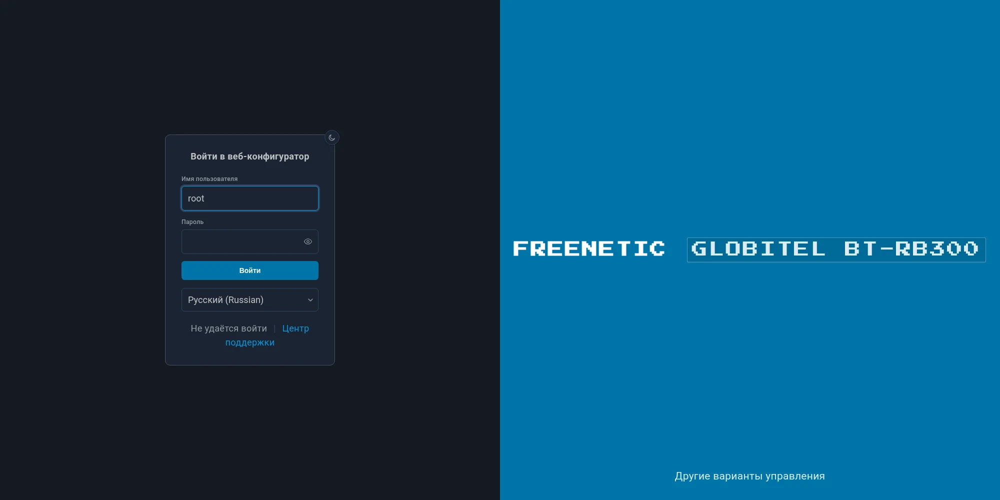
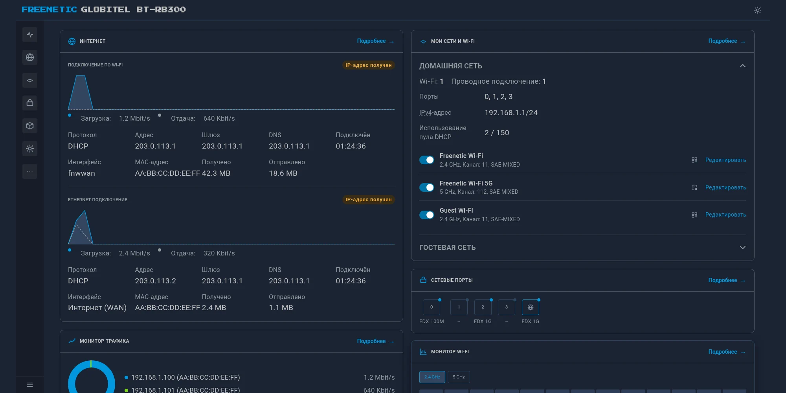
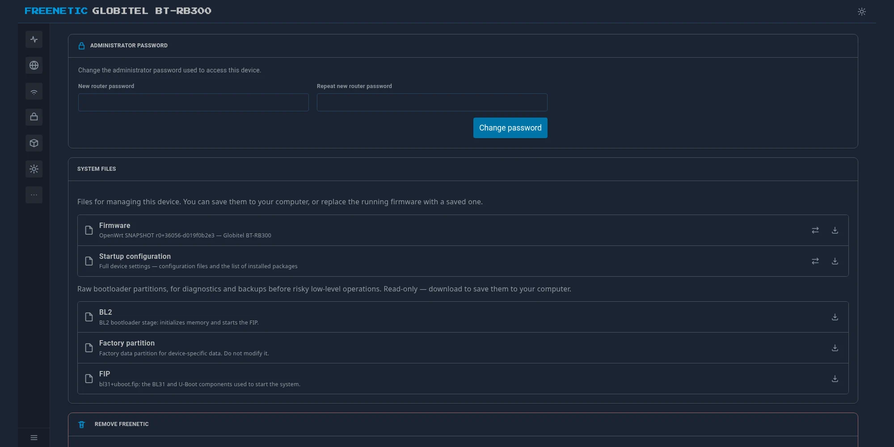
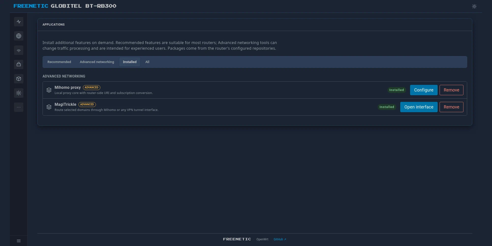

# Freenetic

[Русская версия](README.ru.md)

[Changelog](CHANGELOG.md)

Freenetic is a clean-room reimplementation of Keenetic's UX and CLI on
top of vanilla OpenWrt — not a fork, and not binary-compatible with
proprietary KeeneticOS/NDM. It's a separate layer that reproduces the
familiar Keenetic look and command syntax while talking to
UCI/ubus/rpcd underneath.

> **Disclaimer**: Freenetic is not affiliated with NDM Systems /
> Keenetic and doesn't use their code. The name is a pun (free +
> Keenetic + frenetic), not an attempt to pass as the original product.

Current development hardware is a BT RB300, flashed with plain upstream
OpenWrt — mainline U-Boot, no proprietary components.

| | |
|---|---|
|  |  |
|  |  |

## What's working

**`fnc` CLI** (`cli/`) — an interactive wrapper in the spirit of
`ndmc`, written in C, linking directly against
`libubus`/`libuci`/`libubox` (no new runtime dependencies on the
device). It has its own REPL with a custom line editor, sectioned
`help`, `show version/system/interface/ip/running-config`, an
`interface <name>` context (`ip address`, `ip dhcp client`,
`up`/`down`), `ping`/`traceroute`, `system reboot`, and static routing
(`show ip route`, `ip route`, `no ip route`).

**The web interface** (`web/`) is a from-scratch LuCI interface — not a fork
of a stock theme — reproducing the Keenetic Web look. **The OpenWrt
integration** (`app/`) assembles it into a visual `luci-theme-freenetic`
package and a functional `luci-app-freenetic` package with menus, ACLs and
server-side helpers. The shell is switchable like any other LuCI theme: pick
Bootstrap and it is gone, pick Freenetic back and it returns. Running on real
hardware right now:

- Dashboard, Traffic Monitor, Wi-Fi Monitor
- Dashboard and Traffic Monitor live metrics use one authenticated SSE stream
  (with an automatic polling fallback on older browsers/images)
- Internet (multi-WAN)
- My Networks & Wi-Fi — Home/Guest network with a real backend behind
  it (separate subnet, DHCP, firewall isolation), plus Client List
- Network Rules: Port Forwarding, Firewall, Routing (IPv4/IPv6 and DNS routes, including Windows route-file import)
- Other Connections: native WireGuard connections plus optional AmneziaWG/AWG
  configuration import and a signed, target-specific package-feed installer
- Diagnostics: WAN addressing, gateway/DNS state, bounded ping and traceroute
- Management: System (firmware download/flash, config+package backup,
  bootloader partition dumps), Applications (an install catalog built
  on top of `apk`; needs `luci-app-package-manager` installed, which
  `app/deploy.sh` takes care of), Dynamic DNS (native `ddns-scripts` profiles)
- Wi-Fi ACL (per-SSID allow/deny lists backed by native OpenWrt
  `macfilter`/`maclist`, with Client List integration)
- Access & Routing Policy for whole network segments or individual devices:
  Direct (WAN), WireGuard/AmneziaWG VPN and Block Internet modes

Not built yet: IntelliQoS, Mobile/DSL/Wireless ISP connection types, the
application traffic analyzer, and cross-links between cards.

## Roadmap

Right now the priority is finishing UX parity with KeeneticOS across
LuCI and `fnc`. After that: mesh compatibility with real Keenetic
devices (the `mws` protocol) — a clean-room implementation based on
passive traffic analysis between actual Keenetic hardware, not on
donor binary code. Hasn't started yet.

## Layout

- `app/luci-theme-freenetic/` — OpenWrt package for the visual theme shell.
- `app/luci-app-freenetic/` — OpenWrt package for router management views,
  rpcd ACLs, LuCI menus and backend helpers.
- `web/theme/` and `web/application/` — browser sources for those two packages;
  `web/docs/` holds screenshots.
- `cli/` — the standalone C implementation of the `fnc` console client.

Dependencies point one way: each `app/` package links to its matching `web/`
source directory, while `web/` does not know the OpenWrt package layout.
`luci-app-freenetic` depends on `luci-theme-freenetic`; neither web component
is a standalone SPA.

## Development checks

Syntax, policy and unit checks need no OpenWrt buildroot and are also run by
CI:

```sh
make check-static
```

Run the complete local suite, including CLI cross-compilation, with an OpenWrt
buildroot available next to this repository (or pass its path explicitly):

```sh
make check OPENWRT_DIR=/path/to/openwrt
```

To build both installable LuCI packages as well:

```sh
make check-package OPENWRT_DIR=/path/to/openwrt DL_DIR=/path/to/openwrt/dl
```

The package directories in the buildroot must point to the matching package
components:

```sh
ln -s /path/to/freenetic/app/luci-theme-freenetic /path/to/openwrt/package/luci-theme-freenetic
ln -s /path/to/freenetic/app/luci-app-freenetic /path/to/openwrt/package/luci-app-freenetic
```
