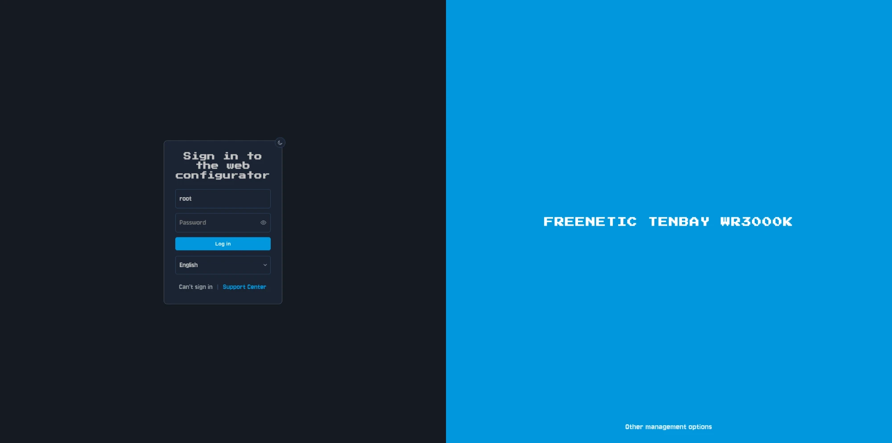
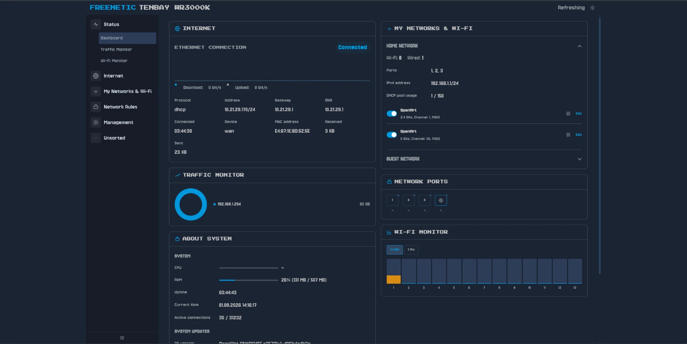
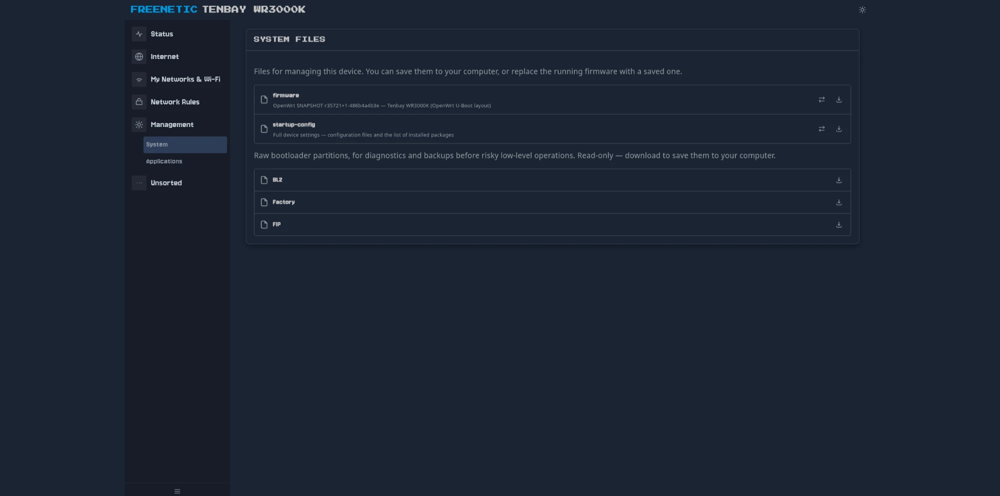
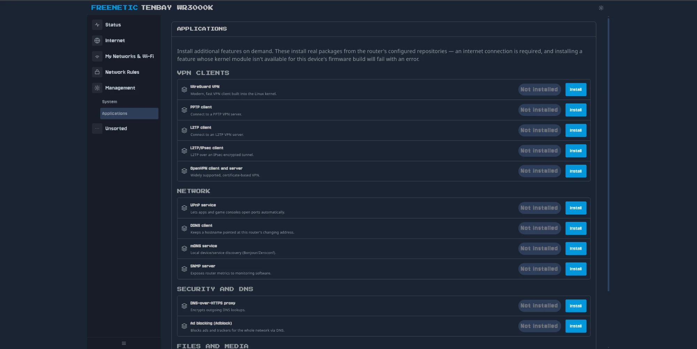

# Freenetic

[English version](README.md)

Freenetic — clean-room реализация UX и CLI Keenetic поверх чистого
OpenWrt. Не форк и не бинарная совместимость с проприетарной
KeeneticOS/NDM — отдельный слой, который воспроизводит привычный вид
и синтаксис команд Keenetic, а под капотом говорит на UCI/ubus/rpcd.

> **Дисклеймер**: Freenetic не аффилирован с NDM Systems / Keenetic и
> не использует их код. Название — игра слов (free + Keenetic +
> frenetic), не попытка выдать себя за оригинальный продукт.

Аппаратная база разработки — Tenbay WR3000K (MediaTek MT7981),
прошитый чистым upstream OpenWrt: mainline U-Boot, без проприетарных
компонентов.

| | |
|---|---|
|  |  |
|  |  |

## Что уже работает

**CLI `fnc`** (`cli/`) — интерактивная обёртка в духе `ndmc`, C,
линкуется напрямую против `libubus`/`libuci`/`libubox` (без новых
рантайм-зависимостей на устройстве). Свой REPL со своим line-editor,
секционный `help`, `show version/system/interface/ip/running-config`,
контекст `interface <name>` (`ip address`, `ip dhcp client`,
`up`/`down`), `ping`/`traceroute`, `system reboot`, статическая
маршрутизация (`show ip route`, `ip route`, `no ip route`).

**`luci-theme-freenetic`** (`luci-theme-freenetic/`) — самостоятельная
LuCI-тема, написанная с нуля (не форк стоковых), воспроизводящая
внешний вид Keenetic Web, и переключаемая как обычная тема: выбрал
Bootstrap — Freenetic пропал, выбрал обратно — всё вернулось. Сейчас
работает на живом устройстве:

- Dashboard, Traffic Monitor, Wi-Fi Monitor
- Internet (мульти-WAN)
- My Networks & Wi-Fi — Домашняя/Гостевая сеть с реальным бэкендом
  (отдельная подсеть, DHCP, firewall-изоляция), плюс Client List
- Network Rules: Port Forwarding, Firewall
- Management: System (скачивание/прошивка образа, бэкап конфигов и
  списка пакетов, дампы разделов загрузчика), Applications (каталог
  устанавливаемых компонентов поверх `apk`)

Не готово: DDNS, Wi-Fi ACL, IntelliQoS, Mobile/DSL/Wireless ISP
подключения, анализатор трафика приложений, страница диагностики,
перекрёстные ссылки между карточками.

## Дальше по плану

Сейчас в приоритете — довести UX-паритет с KeeneticOS в LuCI и `fnc`.
После этого — меш-совместимость с реальными устройствами Keenetic
(протокол `mws`): независимая clean-room реализация по итогам
пассивного анализа трафика между настоящими устройствами, без
использования кода донорских бинарников. Пока не начато.

## Структура репозитория

- `cli/` — исходники `fnc`.
- `luci-theme-freenetic/` — LuCI-тема.

## Благодарности

Значительная часть `luci-theme-freenetic` и `fnc` написана в паре с
[Claude Code](https://github.com/claude)
([Anthropic](https://www.anthropic.com/)).
