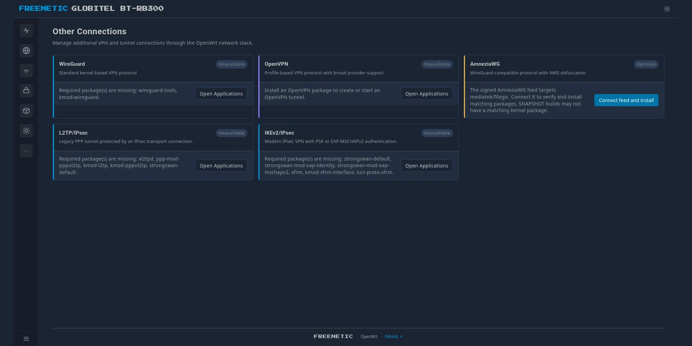
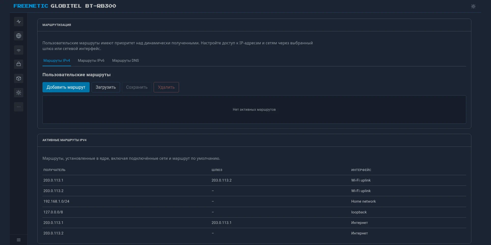
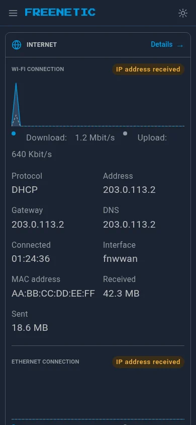

# Freenetic

[English version](README.md)

[История изменений](CHANGELOG.md)

Freenetic — clean-room реализация UX и CLI Keenetic поверх чистого
OpenWrt. Не форк и не бинарная совместимость с проприетарной
KeeneticOS/NDM — отдельный слой, который воспроизводит привычный вид
и синтаксис команд Keenetic, а под капотом говорит на UCI/ubus/rpcd.

> **Дисклеймер**: Freenetic не аффилирован с NDM Systems / Keenetic и
> не использует их код. Название — игра слов (free + Keenetic +
> frenetic), не попытка выдать себя за оригинальный продукт.

Текущая аппаратная база разработки — BT RB300, прошитый чистым upstream
OpenWrt: mainline U-Boot, без проприетарных компонентов.

## Поддерживаемое железо

Релизные APK намеренно ограничены двумя проверенными семействами MediaTek:

| OpenWrt target | CPU ABI | Минимальный профиль |
|---|---|---|
| `mediatek/filogic` | `aarch64` | 2 ядра, 128 MiB RAM, 32 MiB свободного overlay |
| `ramips/mt7621` | `mipsel_24kc` | 2 ядра, 128 MiB RAM, 16 MiB свободного overlay |

Остальные target'ы блокируются pre-install-проверкой пакета. Перед
тестовым деплоем ту же read-only проверку по SSH можно запустить отдельно:

```sh
app/check-router.sh root@192.168.1.1
```

Пороги для конкретной среды можно увеличить переменными
`FREENETIC_MIN_RAM_MIB`, `FREENETIC_MIN_CPU_CORES`,
`FREENETIC_MIN_OVERLAY_MIB_FILOGIC` и
`FREENETIC_MIN_OVERLAY_MIB_MT7621`.

## Быстрая установка

На совместимом OpenWrt с `apk` текущий закреплённый релиз можно установить
одной командой из локальной оболочки:

```sh
sh <(wget -qO - 'https://raw.githubusercontent.com/unisequence/freenetic/main/install.sh')
```

Installer сначала проверяет роутер, затем скачивает четыре LuCI APK и
подходящий бинарник `fnc`, проверяет каждый файл по SHA-256 и ставит `fnc` в
`/usr/bin/fnc`. Русские пакеты устанавливаются, но текущий язык LuCI сам не
переключается.

| | |
|---|---|
|  |  |
|  |  |
|  |  |
|  | |

## Что уже работает

**CLI `fnc`** (`cli/`) — интерактивная обёртка в духе `ndmc`, C,
линкуется напрямую против `libubus`/`libuci`/`libubox` (без новых
рантайм-зависимостей на устройстве). Свой REPL со своим line-editor,
секционный `help`, `show version/system/interface/ip/running-config`,
контекст `interface <name>` (`ip address`, `ip dhcp client`,
`up`/`down`), `ping`/`traceroute`, `system reboot`, статическая
маршрутизация (`show ip route`, `ip route`, `no ip route`).

**Web-интерфейс** (`web/`) — самостоятельный интерфейс LuCI, написанный
с нуля (не форк стоковых тем) и воспроизводящий внешний вид Keenetic Web.
**Интеграция с OpenWrt** (`app/`) собирает его в визуальный пакет
`luci-theme-freenetic` и функциональный `luci-app-freenetic` с меню, ACL и
серверными helpers. Оболочка переключается как обычная тема: выбрал Bootstrap
— Freenetic пропал, выбрал обратно — вернулся. Сейчас работает на живом
устройстве:

- Dashboard, Traffic Monitor, Wi-Fi Monitor
- Живые метрики Dashboard и Traffic Monitor идут одним авторизованным SSE-потоком
  (с автоматическим возвратом к polling на старых браузерах/образах)
- Internet (мульти-WAN)
- My Networks & Wi-Fi — Домашняя/Гостевая сеть с реальным бэкендом
  (отдельная подсеть, DHCP, firewall-изоляция), плюс Client List
- Network Rules: Port Forwarding, Firewall, Routing (IPv4/IPv6 и DNS-маршруты, включая импорт Windows route-файлов)
- Other Connections: нативные подключения WireGuard, OpenVPN, L2TP/IPsec и
  IKEv2/IPsec, импорт конфигураций AmneziaWG/AWG и опциональный установщик
  подписанного feed под конкретную версию/target устройства
- Диагностика: адреса WAN, шлюз/DNS, ограниченные ping и traceroute
- Management: System (скачивание/прошивка образа, бэкап конфигов и
  списка пакетов, дампы разделов загрузчика), Applications (каталог
  устанавливаемых компонентов поверх `apk`; нужен установленный
  `luci-app-package-manager` — `app/deploy.sh` ставит его сам), Dynamic DNS
  (нативные профили поверх `ddns-scripts`)
- Wi-Fi ACL (allow/deny-списки для каждого SSID поверх штатных
  `macfilter`/`maclist`, с добавлением устройств из Client List)
- Access & Routing Policy для целой сети или отдельного устройства:
  Direct (WAN), VPN через WireGuard/AmneziaWG/OpenVPN/L2TP/IPsec/IKEv2 и Block
  Internet

Не готово: другие legacy VPN-клиенты, IntelliQoS,
Mobile/DSL/Wireless ISP-подключения и анализатор трафика приложений.

## Дальше по плану

Сейчас в приоритете — довести UX-паритет с KeeneticOS в LuCI и `fnc`.
После этого — меш-совместимость с реальными устройствами Keenetic
(протокол `mws`): независимая clean-room реализация по итогам
пассивного анализа трафика между настоящими устройствами, без
использования кода донорских бинарников. Пока не начато.

## Структура репозитория

- `app/luci-theme-freenetic/` — пакет OpenWrt с визуальной оболочкой темы.
- `app/luci-app-freenetic/` — пакет OpenWrt со страницами управления,
  rpcd ACL, меню LuCI и backend helpers.
- `web/theme/` и `web/application/` — браузерные исходники этих пакетов;
  скриншоты находятся в `web/docs/`.
- `cli/` — самостоятельный консольный клиент `fnc` на C.

Зависимости направлены в одну сторону: каждый пакет из `app/` ссылается на
свой каталог исходников в `web/`, а `web/` ничего не знает о структуре пакетов
OpenWrt. `luci-app-freenetic` зависит от `luci-theme-freenetic`; оба
web-компонента рассчитаны на среду LuCI и не являются отдельными SPA.

## Проверки для разработки

Проверки синтаксиса, сетевой политики и unit-тесты не требуют buildroot
OpenWrt и также запускаются в CI:

```sh
make check-static
```

Полный локальный набор, включая кросс-сборку CLI для Filogic и MT7621 при
наличии обоих toolchain'ов, запускается при наличии buildroot OpenWrt рядом
с репозиторием (либо с явным путём):

```sh
make check OPENWRT_DIR=/путь/к/openwrt
```

Дополнительно собрать оба устанавливаемых пакета LuCI:

```sh
make check-package OPENWRT_DIR=/путь/к/openwrt DL_DIR=/путь/к/openwrt/dl
```

В buildroot каталоги пакетов должны ссылаться на соответствующие компоненты:

```sh
ln -s /путь/к/freenetic/app/luci-theme-freenetic /путь/к/openwrt/package/luci-theme-freenetic
ln -s /путь/к/freenetic/app/luci-app-freenetic /путь/к/openwrt/package/luci-app-freenetic
```
